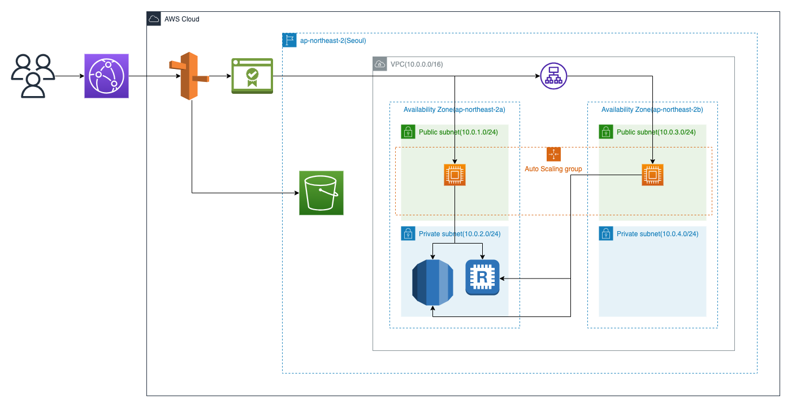

# 👫 하나메이트

## 💬 프로젝트 소개
용돈 요청 및 관리부터 모임통장까지! <b>청소년의 금융을 책임지는 플랫폼</b>입니다. <br />
부모, 친구와 함께 금융을 공부하고 <b>좋은 금융 습관</b>을 기를 수 있습니다.

<br>

## 🙋 팀원 소개

|  |  |  |
|:----------------------------------------------------------------------:|:-----------------------------------------------------------------------:|:---------------------------------------------------------------------:|
|                  [민새미](https://github.com/petcu1004)                   |                  [권민선](https://github.com/helloalpaca)                  |                  [최안식](https://github.com/Ansix1207)                  |
|                                 Leader                                 |                                 Member                                  |                                Member                                 |
|                     JWT 기반 로그인 개발 <br /> 대출 기능 구현                      |                         용돈 기능 구현 <br /> CICD 배포                         |                       모임통장 기능 구현 <br /> CICD 배포                       |
<br>

## 🛠️ 기술 스택 


## ⚡ 주요 기능

### 1) 용돈 주고받기를 통한 부모님과의 상호작용
- 아이 : 용돈 조르기, 용돈 내역 확인
- 부모 : 용돈 조르기 승인, 용돈 이체(수시/정기)

### 2) 모임 통장으로 친구들과 함께 용돈 관리하고 추억 공유하기
- 모임통장 생성, 거래내역 확인, 글 생성, 댓글 달기, 좋아요

### 3) 대출을 통해서 금융 배우기
- 아이 : 대출 신청, 대출 상환
- 부모 : 대출 승인/거절

## 📂 Folder Structure

도메인형 폴더 구조를 선택했습니다.

- Controller: 사용자의 요청에 따른 적절한 동작을 수행한 후 응답합니다.

- Service: 비즈니스 로직을 담당합니다. 

- Repository : 데이터베이스 접근 로직을 담당합니다. 

- DTO: 데이터를 담는 객체들을 모아놓았습니다.

- resources: 환경설정 파일들을 모아놓았습니다.

```
├── main
│   ├── java
│   │   ├── com
│   │   │   ├── domain                    # 로직을 기능 단위별로 묶은 패키지
│   │   │   │   ├── controller            # 사용자의 요청 처리 및 응답을 담당하는 컨트롤러들
│   │   │   │   ├── service               # 비즈니스 로직을 담당하는 서비스 클래스들
│   │   │   │   ├── dto                   # DTO (Data Transfer Object) 클래스들
│   │   │   │   ├── repository            # 데이터베이스 접근을 담당하는 코드들
│   │   │   ├── entities                  # DB 엔티티를 모아놓은 폴더
│   │   │   ├── global                    # 에러 처리, 핸들러, Config 파일들을 모아놓은 폴더
│   │   │   ├── infra                     # 프로젝트 배포를 위한 파일
│   │   │   ├── jwt                       # JWT 기반 인증/인가 시스템을 구현하기 위한 로직, 필터
│   │   │   ├── security                  # 스프링 시큐리티와 관련된 로직
│   ├── resources
│   │   ├── application.properties             # 프로젝트 실행시 필요한 정보를 저장
│   │   ├── application-S3.properties          # AWS S3 연결 정보를 저장
│   │   ├── data.sql                           # 테스트를 위한 초기 데이터
└── README.md                            # 프로젝트에 대한 설명이 적힌 README 파일
```

<br>

## 🌐 아키텍처

### 1) 서버 아키텍처

### 2) 배포 아키텍처

